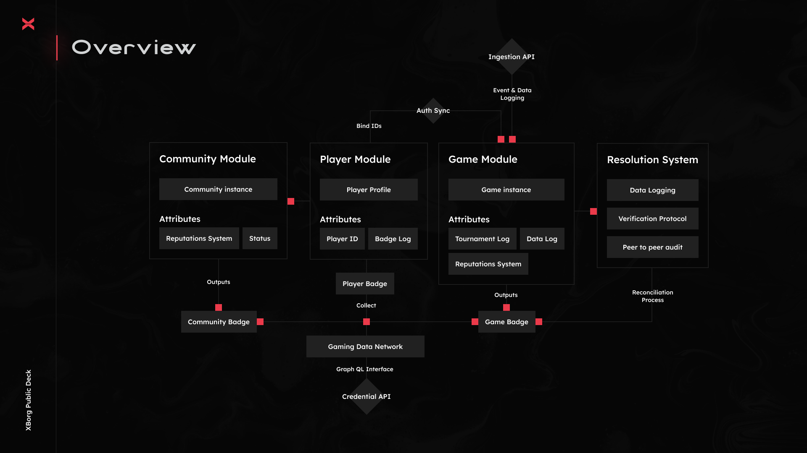

# Gaming Credential Network

> Voordat je de volgende vragen gaat verkennen, bekijk de presentatie van het Gaming Credential Network: [#wat-is-een-gaming-credential-netwerk](gaming-credential-network.md#wat-is-een-gaming-credential-netwerk "vermelding") :sunglasses:

Waarom een Gaming Credential Network bouwen?

In de huidige samenleving, waar vrije tijd steeds overvloediger wordt, spenderen spelers talloze uren in gaming werelden. Toch wordt de data die uit deze ervaringen voortkomt vaak ondergewaardeerd en versnipperd over meerdere games. XBorg erkent de waarde van de tijd van spelers en streeft ernaar om hun data betekenisvol en waardevol te maken. Denk aan een gaming [**Decentralized Identifier (DID)**](https://www.w3.org/TR/did-core/) systeem.\
\
Bovendien maakt het Gaming Credential Network de creatie van betere gaming applicaties mogelijk en zorgt het voor interoperabiliteit gebonden aan de identiteit van spelers.

Wat zijn de voordelen voor spelers?

* Spelers bezitten en centraliseren hun gaming data op één plek
* Spelers krijgen toegang tot gaming applicaties en hulpmiddelen binnen het ecosysteem
* Spelers kunnen hun data monetiseren

Wat zijn de voordelen voor ontwikkelaars?

* Ontwikkelaars kunnen op maat gemaakte spelerservaringen ontwikkelen
* Bedrijven kunnen gebruikers verwerven door spelers tegen betaling te targeten
* Het Gaming Credential Network biedt directe toegang tot games en ontwikkelaars, waardoor hun bereik wordt vergroot
* Ontwikkelaars kunnen toegang krijgen tot meer gedetailleerde data, waardoor de nauwkeurigheid van matchmaking en andere app-functies wordt verbeterd
* Het platform maakt nieuwe gebruiksmogelijkheden voor applicaties mogelijk, waaronder op reputatie gebaseerde leningen

Hoe ziet een speler ID eruit?

Het speler ID is een Soulbound token dat een aggregatie vertegenwoordigt van alle Soulbound tokens die door de gebruiker zijn verkregen. Het speler ID omvat ook Soulbound tokens buiten het XBorg ecosysteem, zoals het Lens protocol.

Kunnen ontwikkelaars nu al applicaties gaan bouwen bovenop het credential netwerk?

Op dit moment is het Gaming Credential Network gecentraliseerd. Zodra het netwerk gedecentraliseerd is, kunnen ontwikkelaars er bovenop bouwen.

Hoe schaal je het Gaming Credential Network op?

De gaming- en community-engagement-app is de belangrijkste applicatie die ons in staat stelt het Gaming Credential Network op te schalen.

Hoe wordt de privacy van gegevens behandeld?

Toekomstige iteraties van het protocol zullen spelers in staat stellen om relevante datapunten selectief bekend te maken door opt-in/opt-out functionaliteit mogelijk te maken. Bovendien zullen zero-knowledge technologieën worden geïntegreerd in volgende updates, waarbij de onwrikbare toewijding van het platform aan privacy en gegevensbeveiliging wordt benadrukt.

Wat zijn de modules van het Credential Network?

* Community
* Speler
* Spel

### 

Is het Gaming Credential Network on-chain?

Op dit moment wordt het Gaming Credential Network veilig off-chain opgeslagen. Echter, zodra het ecosysteem tractie krijgt en de gebruikersbasis de drempel van 100.000 overschrijdt, zal het netwerk naadloos overgaan naar de blockchain, waarbij de onwrikbare toewijding van XBorg aan toegankelijkheid en transparantie wordt benadrukt.

Is de ontwikkelaarsdocumentatie of SDK klaar?

Het is momenteel in ontwikkeling, maar zal pas eind 2023 worden uitgebracht.

Op welke blockchain wordt het Credential Network gebouwd?

In eerste instantie Polygon en andere L2. Naarmate het netwerk tractie krijgt, zal het zijn eigen L2/L3 worden, bekend als de Borg chain.

Wat zijn de beperkingen van het Gaming Credential Network?

* **Sybil-resistentie:** Een inherente beperking van netwerkinfrastructuur ligt in de vatbaarheid van gebruikers om valse identiteiten aan te nemen of geavanceerde technologieën zoals kunstmatige intelligentie te gebruiken om hun digitale identiteiten te manipuleren. Om de schadelijke effecten van Sybil-aanvallen te beperken, omvat een effectieve strategie de integratie van een Proof of Identity mechanisme in het onderliggende protocol van het netwerk.

<!---->

* **Schaalbaarheid**: De werkelijke waardepropositie van het credential netwerk is afhankelijk van het bereiken van een vereist schaalniveau, een prioriteit die momenteel van groot strategisch belang is voor XBorg. Echter, zodra dit doel is bereikt, zijn de potentiële mogelijkheden die uit het netwerk kunnen worden afgeleid werkelijk grenzeloos.

